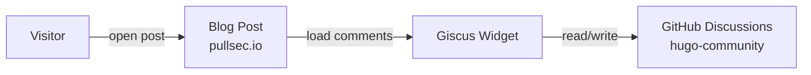

  
  
  
  
  

  <a href="https://github.com/pullsec/hugo-community/discussions">Open Discussion</a>
  ·
  <a href="https://github.com/pullsec/hugo-community/issues">Report Bug</a>

<!-- TABLE OF CONTENTS -->

  
Table of Contents

  <ol>
    <li><a href="#about">about</a></li>
    <li><a href="#architecture">architecture</a></li>
    <li><a href="#discussion-model">discussion-model</a></li>
    <li><a href="#repository-role">repository-role</a></li>
    <li><a href="#giscus-integration">giscus-integration</a></li>
    <li><a href="#moderation-workflow">moderation-workflow</a></li>
    <li><a href="#discussion-categories">discussion-categories</a></li>
    <li><a href="#faq">faq</a></li>
  </ol>

---

## about

This repository stores the **public discussions and comments** for the PullSec blog using **GitHub Discussions** and **Giscus**.

It acts as the discussion backend for the blog and is intentionally separated from both:

- the private blog engine repository
- the public content repository

This keeps the overall architecture modular and easy to maintain.

## architecture

> [!IMPORTANT]
> The blog embeds GitHub Discussions through Giscus, using this repository as the comment backend.

### workflow summary

| Stage          | Component           | Role                           | Description                                      |
|----------------|---------------------|--------------------------------|--------------------------------------------------|
| Comment UI     | Blog page           | Frontend                       | Displays the embedded Giscus discussion widget   |
| Authentication | GitHub account      | User identity                  | Required to post and interact                    |
| Backend        | `hugo-community`    | Discussion store               | Stores comments and reactions via Discussions    |
| Moderation     | GitHub Discussions  | Moderation and management      | Handles review, deletion, locking, and cleanup   |

## discussion-model

Each blog page is mapped to a discussion thread through Giscus using a page-to-discussion mapping strategy.

Typical usage includes:

- post comments
- feedback on technical content
- suggestions and corrections
- interaction on pages like `friends/`

This repository contains **discussion data only**.  
It does not contain the blog engine or the published content itself.

## repository-role

This repository is part of a three-repository architecture:

| Repository         | Visibility | Purpose                                  |
|--------------------|-----------|------------------------------------------|
| `hugo-fixit`       | Private   | Hugo engine, configuration, deployment   |
| `hugo-content`     | Public    | Public markdown content                  |
| `hugo-community`   | Public    | GitHub Discussions / Giscus backend      |

## giscus-integration

The blog uses Giscus to embed discussions from this repository directly into pages.

Typical configuration includes:

- repository: `pullsec/hugo-community`
- category: `General`
- mapping: `pathname`

### expected flow

1. A visitor opens a page on the blog
2. Giscus loads the corresponding GitHub Discussion
3. If no discussion exists yet, Giscus can create one automatically
4. The user comments using a GitHub account

## moderation-workflow

> [!NOTE]
> Moderation is performed directly through GitHub Discussions.

Typical moderation tasks include:

- reviewing comments
- deleting spam
- locking threads if needed
- organizing categories
- responding to feedback

This keeps moderation simple and does not require any self-hosted comment system.

## discussion-categories

Suggested categories for long-term organization:

| Category   | Purpose                              |
|------------|--------------------------------------|
| General    | Default comments and post discussions |
| Feedback   | Site improvements and suggestions     |
| Ideas      | New content ideas or feature requests |
| Friends    | Friend link exchange requests         |

These can be expanded over time depending on the blog’s growth.

## faq

### do users need a GitHub account?

Yes. GitHub authentication is required to post comments via Giscus.

### is this repository meant to contain code?

No. Its primary purpose is to host Discussions and act as a comment backend.

### can this be used for other interactions besides blog comments?

Yes. It can also be used for:
- feedback threads
- friend link requests
- community discussions related to the blog
